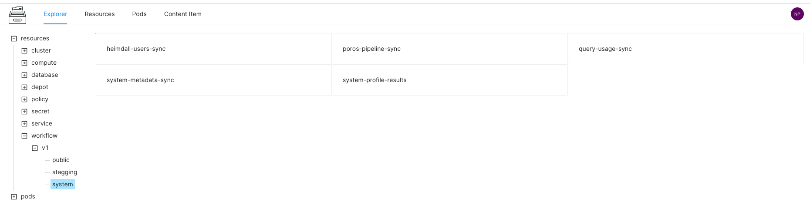

# Scanner

The Scanner stack in DataOS is a Python-based framework for extracting metadata from external source systems (e.g., Snowflake, Looker, MySQL, Kafka, etc.) and the components/ services within the DataOS environment. This stack enables you to define the interaction with source systems containing the metadata we want to extract,  both general information, such as dataset/table name, owner, tags, etc., as well as more granular metadata, like schema of table and names of columns, etc. The Scanner stack also helps fetch metadata around data quality & profile, query usage, dashboards, workflows, ML models, and user information for your data assets.

## How does Scanner Stack Work?

Within DataOS, the extraction of metadata can be treated as a job. To run such a job, you create the DataOS Resource called ‘Workflow’. This stack allows you to write workflows to "crawl" or "ingest" metadata from the metadata sources into meta store in a batch or incremental-batch manner. A typical Scanner workflow consists of a source, transformations, and sink. Like any other ETL job, it connects with the metadata source, extracts metadata, and performs transformations to convert it into a standard metadata format. This transformed metadata is pushed to the REST API server backed by a metadata store/database( for example, MySQL or Postgres). 

> 🗣 The default metadata store in DataOS is MetisDB which is a PostGRE database.

The stored metadata is used by various DataOS components for discoverability, governance, and observability. External apps running on top of DataOS can also fetch this metadata via Metis server APIs.

> 🗣 In DataOS, all the metadata entities are defined and consumed in JSON format.

The following diagram explains the metadata extraction using the Scanner stack.
 

.png)

<figcaption align = "center">DataOS Scanner stack for metadata extraction</figcaption>
 

You can write Scanner workflows in the form of a sequential YAML for a pull-based metadata extraction system built into DataOS for a wide variety of sources in your data stack. You can schedule these workflows to run metadata extraction automatically. Run these workflows via the DataOS CLI.

## Interaction with other DataOS Components/Apps

The Scanner stack also supports connecting with various DataOS apps/components and getting the information surfaced by the individual apps. The scanner job reads related metadata and pushes it to the metadata store through the REST API server.

Poros: For metadata extraction related to historical data about workflows and resource consumptions. The scanner job gets workflow-related information and their execution states.

Data Profile and Quality App: Keeps profiling and quality test data obtained from any of the tools your organization might be using, like Deequ, SODA, and Great Expectations. Scanner job scans information related to data profiling and quality checks and their validation states.

Gateway: Keeps query usage data, cluster usage statistics, dataset usage analytics, and harvests required insights such as (heavy datasets, popular datasets, datasets most associated together, etc.). The scanner job connects with the Gateway service and scans query-related data.

Hera: Keeps information about lineage and topology for the datasets. The Scanner job connects with Hera for datasets' lineage and transformations. 

Odin: Creates Knowledge graphs built with semantic metadata to give your data business context. It enables you to inspect relationships between assets of your entire data ecosystem.

Heimdall: The scanner job connects with Heimdall and scans information about the users present in the DataOS environment, their descriptions, and images. All this user information will be available on Metis UI.

## Creating Scanner Workflow

[Creating Scanner Workflow Page](./Creating%20Scanner%20Workflow.md)

## Supported Scanner Workflows

In this section, you can explore the different workflows for scanning specific types of metadata and how to configure them.

> 🗣 DataOS Scanner is a flexible and extensible framework, you can easily integrate it with new sources.

### Entity Metadata

Within DataOS, different workflows can be deployed and scheduled, which will connect to the data sources to extract Entities’ metadata such as Tables, Topics, Dashboards, etc.

These sources could be Relational Database Management Systems/ Data Warehouses/ Dashboards /Messaging services etc.

You can create the following two types of workflow DAGs to scan entity metadata.

### Depot Scan Workflow

With this type of Scanner workflow, depots are used to get connected to the metadata source to extract Entities’s metadata. It enables you to scan all the datasets referred by a depot. You need to provide the depot name or address by declaring the Universal Data Link(UDL), which will connect to the data source. The connection details for that source will be pulled from the depot service, and secrets will be requested from the governance engine, Heimdall. 

> Depots provide references to the location of different storage systems. Depot service manages depots, secrets, and connection details associated with each depot. It contains details about all datasets present within a depot and metadata of those datasets. To learn more, refer to [Depot](../../Primitives/Depot/Depot.md).
> 

To learn more, refer to
[Creating Depot Scan Workflow Page](./Creating%20Depot%20Scan%20Workflow.md).

#### Supported Data Sources for Depot Scan

Here you can find templates to run Scanner workflows on depots. 
[Templates for Depot Scan](./Templates%20for%20Depot%20Scan/Templates%20for%20Depot%20Scan.md).

### Non-Depot Scan Workflow

Non-Depot Scanner workflow can capture schema details such as table names, constraints, primary keys, etc., for the external data stored with structured data sources(RDBMS/ Data Warehouses). It can also connect with Dashboard and Messaging services to get the related metadata. For example, in the case of dashboards, it extracts information about the dashboard, dashboard Elements, queries, and associated data sources.
[Creating Non-Depot Scan Workflow](./Creating%20Non-Depot%20Scan%20Workflow.md).

#### Supported Data Sources for Non-Depot Scan

Here you can find templates for the non-depot scan workflows. 
[Templates for Non-Depot Scan](./Templates%20for%20Non-Depot%20Scan/Templates%20for%20Non-Depot%20Scan.md).

### Automated System Scanner Workflows

The following workflows are running as system workflows to periodically scan the related metadata and save it to the metastore (Metis DB) to reflect the updated metadata state. They are scheduled to run on a set interval.

> 🗣 You can check system Scanner workflows on the ‘Resource Catalog app’ UI under the `workflow > system` section.

 

<figcaption align = "center">View Scanner system workflows on UI</figcaption>
 

### Data Profiling and Quality

DataOS can leverage Scanner workflows to write jobs that could pull information from data profile (descriptive statistics for the datasets) and data quality tables in an incremental basis and publish it to Metis Metadata storage.

- [Data Profile Scan](./Data%20Profile%20Scan.md)

- [Data Quality Scan](./Data%20Quality%20Scan.md)

### Query History and Dataset Usage

This Scanner workflow will ingest metadata related to query history/dataset usage, which helps to rank the most used tables. It scans information about queries, users, dates, and completion times.
[Query Usage Data Scan](./Query%20Usage%20Data%20Scan.md).

### Pipelines/Workflows Data

For metadata extraction related to historical data about workflows and resource consumption, the following workflow is scheduled.
[Workflows Data Scan](./Workflows%20Data%20Scan.md).

### Users’ information

This workflow will scan the information about the users in DataOS.
[Users Data Scan [WIP]](./Users%20Data%20Scan%5BWIP%5D.md).

### Indexer Services for Metadata Update

The Indexer service is a part of the metadata extraction platform. It is a continuous running service within the DataOS environment that keeps the metadata updated by automating Scanner workflow runs. It keeps track of newly created or updated datasets/topics/workflows. With this information about the changed entity, it creates a reconciliation Scanner YAML with filters to include only the affected entity. This Scanner workflow will extract the metadata about the entity and update the target metastore.

The following indexer services are running within the DataOS environment:

1. Dataset-Metadata Indexer Service: This service will keep polling for newly created and modified datasets by DataOS stacks within Icebase and Fastbase depots and run the reconciliation Scanner to update the target metastore. FilterPatterns applied for Icebase depot will be `databaseFilterPattern`, `SchemaFilterPattern`, or `tableFilterPattern` to include the entities to be scanned. Similarly, FilterPatterns applied for Fastbase depot will be `topicFilterPattern` to include the topics to be scanned for metadata.
2. Workflow-Metadata Indexer Service: This service will keep polling for newly created/updated workflows and run the reconciliation scanner to update the target meta store. 
3. Reactive Data Quality and Data Profiling Service: Just like the dataset indexer service, this service will ingest profiling and quality data for a dataset in the metadata store(Metis DB) once the Flare job completes successfully.
    
    
    > 🗣 The reconciliation Scanner jobs for Icebase and Fastbase depots are scheduled by default in every DataOS environment. So whenever any dataset or topic is written by DataOS stacks into Icebase/Fastbase (in public tenant), the Indexer service gets them scanned periodically by these system jobs.
    
    

## Common Scanner Errors

[Scanner Workflow Related Errors](./Scanner%20Workflow%20Related%20Errors/Scanner%20Workflow%20Related%20Errors.md)