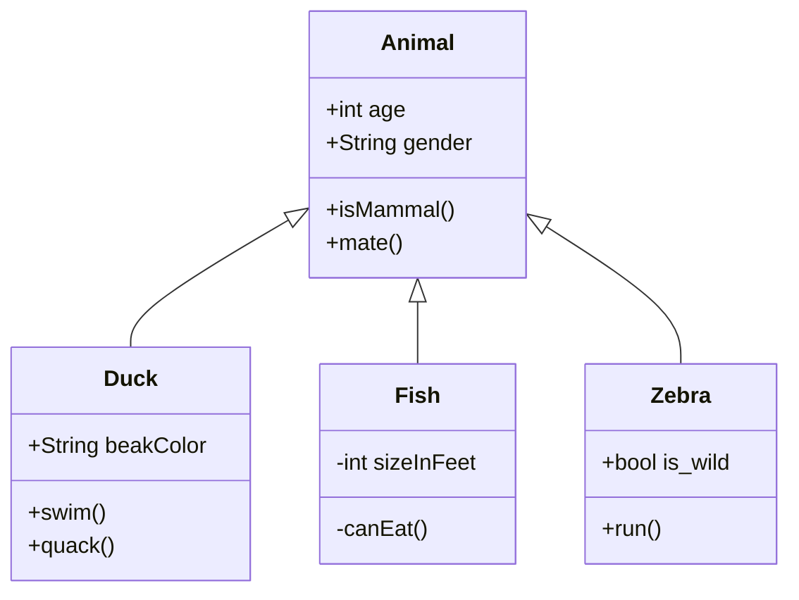
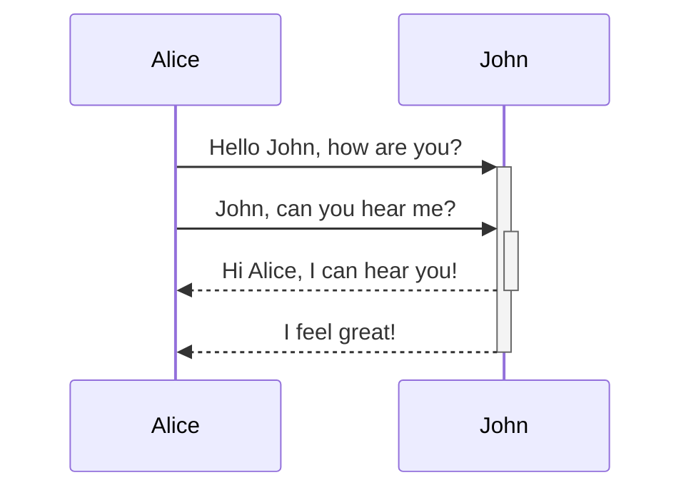
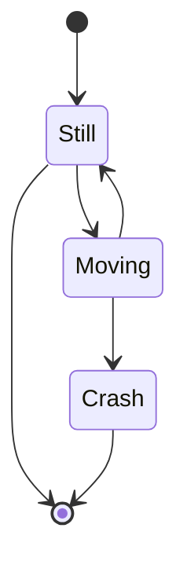
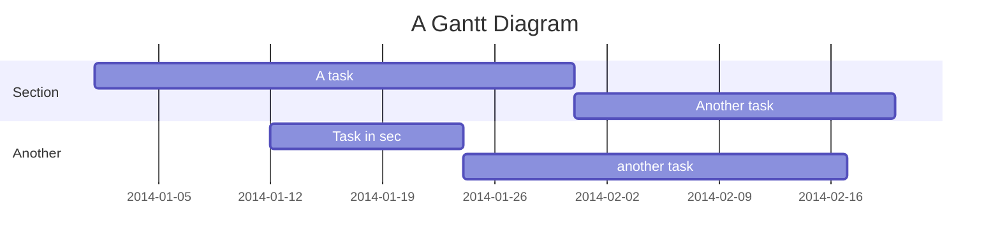
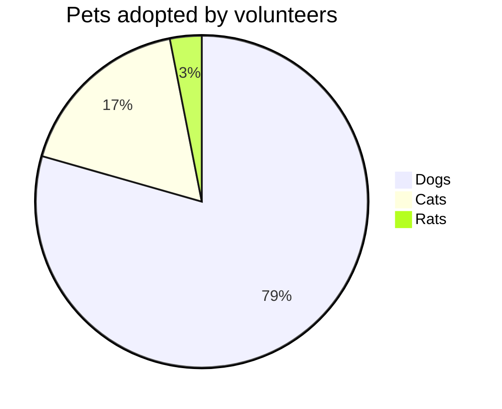
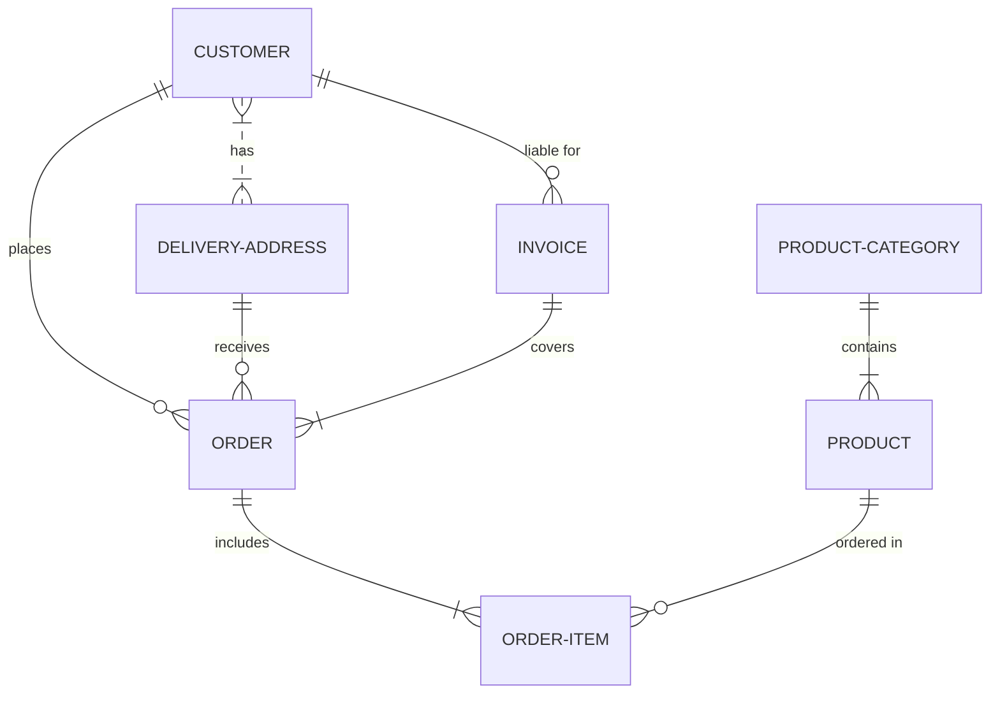

# Mermaid Diagrams
- [Mermaid Home](https://mermaid-js.github.io/mermaid/#/)
- [Mermaid Live Editor](https://mermaidjs.github.io/mermaid-live-editor/)

## Class Diagram

## Sequence Diagram

## State Diagram

## Gantt

## Pie Chart

## ER Diagram
