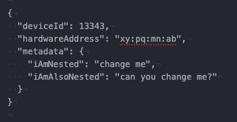

# ** Nested Fields: Spark3 Way **

New ways  of dealing with nested fields in spark **3.1.1**  release.

The spark ecosystem has been evolving rapidly since spark3 has released. The community has been continuously solving major problems being faced by the developers, handling nested fields in spark is never easy. 

For those who are still wondering what are nested fields I am talking about, the below snippet showcase an example json with nested attributes.

In above json snippet metadata contains two nested fields introducing themselves. In traditional spark way, in order to change one of these fields we will have to create another struct with same name and with all the fields like this-

<pre>
<code>deviceDf.withColumn("metadata", struct(
  col("metadata.iAmNested"),
  lit("It's not easy to change this!") // will change <b>iAmAlsoNested</b> 
))
</code></pre>

Think about a metadata field with 50 nested fields! Not at all easy to manipulate the metadata field after that, right?

Here is the modern way of doing this in spark :) Spark 3.1.1 has introduced **withField** api to deal with such a scenario, see the new flavour -

<pre>
<code>deviceDf.withColumn("metadata", 
  'metadata.<b>withField</b>("iAmAlsoNested", lit("<b>Yay! We did that!</b>"))
)
</code></pre>

In essence you can traverse any nested field now and update it like this -

<pre>
<code>deviceDf.withColumn("metadata", 
  col("metadata").withField("<b>x.y.z.deeplyNested</b>", lit("<b>Can deal with deeply nested fields too!</b>"))
))
</code></pre>

Not only updating a nested field, you can also drop one or more nested fields like this -

<pre>
<code>deviceDf.withColumn("metadata",
  col("metadata").<b>dropFields</b>("<b>x.y.z.deeplyNestedOne</b>")
)
</code></pre>

In the end this is life saviour :)