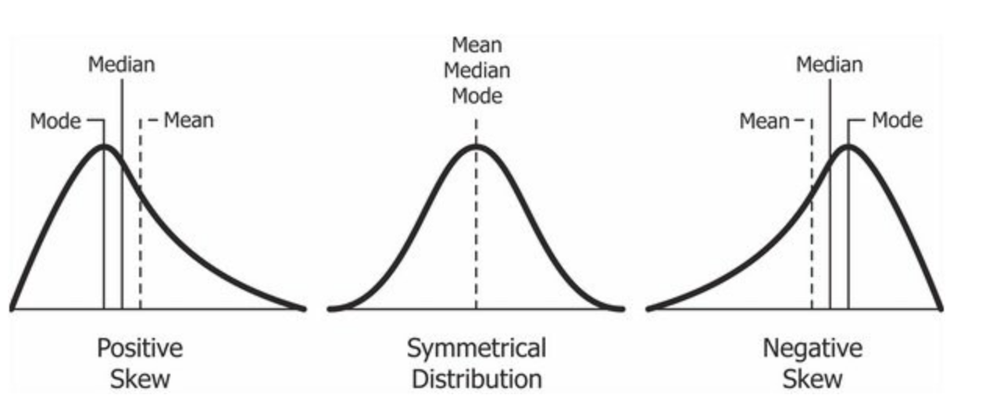
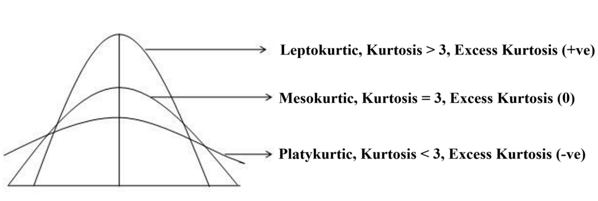

## Skewness

Skewness is the degree of distortion or asymmetry from normal distribution or a symmetrical bell curve. A symmetrical distribution has a skewness of 0.

There are two types of skew:

-  Positive: When the right side tail is longer and thicker than the left, the skewness is said to be positive. The mean is highest followed by median and then mode.

-  Negative: When the left side tail is longer and thicker than the right, the skewness is said to be negative. The mode is highest followed by median and then mean.

Pic credits: codeburst.io

### Measure and Interpretation

- Skewness value between -0.5 and 0.5 indicates that the data is approximately symmetrical.
- Skewness value between  -1 and -0.5 (negatively skewed) or between 0.5 and 1 (positively skewed) indicates that the data is **moderately skewed**.
- Skewness value less than -1 (negatively skewed) or greater than 1   (positively skewed) indicates that the data is **highly skewed**.

Example: 

Lets say a shop has products costing from $100 to $1000, averaging about $500.

If majority of the products cost less than $500, there is positive skewness and if the majority cost more than $500 there is negative skewness. 

## Kurtosis

It is the measure of outliers or extremes present in the data distribution. High kurtosis means that the data is outlier heavy or the tails are heavy, in which case the data needs to be thoroughly investigated. On the other hand, low kurtosis would mean lack of outliers/ light tails, which also mandates an investigation.

### Excess Kurtosis

Excess kurtosis is a metric to compare kurtosis of a normal distribution to that of the relevant data. 

**Excess Kurtosis = Kurtosis - 3**

### Types of Kurtosis

- Mesokurtic (Kurtosis ≈ 3): This distribution has kurtosis statistic similar or close to that of the normal distribution. This includes the outliers conforming to the normal distribution as well.

- Leptokurtic (Kurtosis > 3): This Distribution is longer, tails are fatter, the bulk of data appears in a 'lean' vertical range. Peak is higher and sharper than Mesokurtic, which means that data are heavy-tailed or profusion of outliers.

Pic credits: towardsdatascience.com

- Platykurtic: (Kurtosis < 3): Distribution is shorter, tails are thinner than the normal distribution. The peak is lower and broader than Mesokurtic, which means that data is light-tailed and has a lack of outliers.

