# DataOS<sup>®</sup> Workbench
## Introduction
### Purpose

Workbench is a gateway for the user to explore data stored in any format within DataOS®. Users can write, run, and visualize SQL query results. Goin a step further they can save and share those queries with other users within an organization.
Users can also publish queries to DataOS® Dashboard app in order to create business reports. 
Workbench has all the information from the Profiling and Catalog sections, removing the need to run ad-hoc analysis to understand data quality or working out the business context.


### Presto Query engine

Presto is a distributed SQL query engine designed to query large data sets distributed over one or more heterogeneous data sources. Workbench uses Presto as the primary query engine.

Presto is a tool designed to efficiently query vast amounts of data using distributed queries. Presto was designed as an alternative to tools that query HDFS using pipelines of MapReduce jobs, such as Hive or Pig, but Presto is not limited to accessing HDFS. Presto can be and has been extended to operate over different kinds of data sources, including traditional relational databases and other data sources such as Cassandra.
Presto was designed to handle data warehousing and analytics: data analysis, aggregating large amounts of data and producing reports. These workloads are often classified as Online Analytical Processing (OLAP).
For more details, visit [presto documentation](https://prestosql.io/docs/current)

## Getting Started
### Launching Workbench
Navigating from the apps screen, the workbench launcher can be found in the business section. Please refer to the highlight in the following screenshot

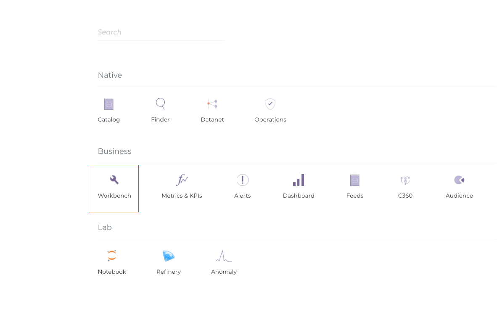

### Choosing a connection

To begin with, the user needs to choose a schema from a dropdown selection of available schemas. Consider this as options to choose between querying datasets vis-a-vis datastreams.

- **DataOS® Heap:** Caching layer, stores rolling data of past two weeks(configurable). Enables App ecosystem

- **DataOS® Table:** Persistence layer, stores all the historical data. Can be accessed by standard query engine.
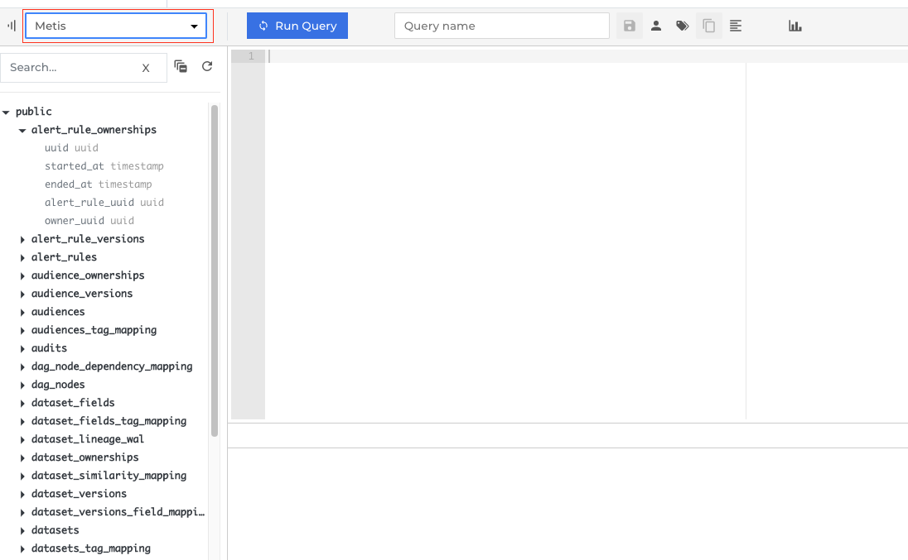

- **Schemas/ Datalake zones:** The left margin shows list of all Schemas/ zones.  The lake can be divided into multiple zones, for instance one such division is described below:
     1. Raw - Immutable storage area
     2. Transient - Data stored temporarily for processing
     3. Enriched - Enhanced/Processed data storage
     4. Common - Curated data storage area
     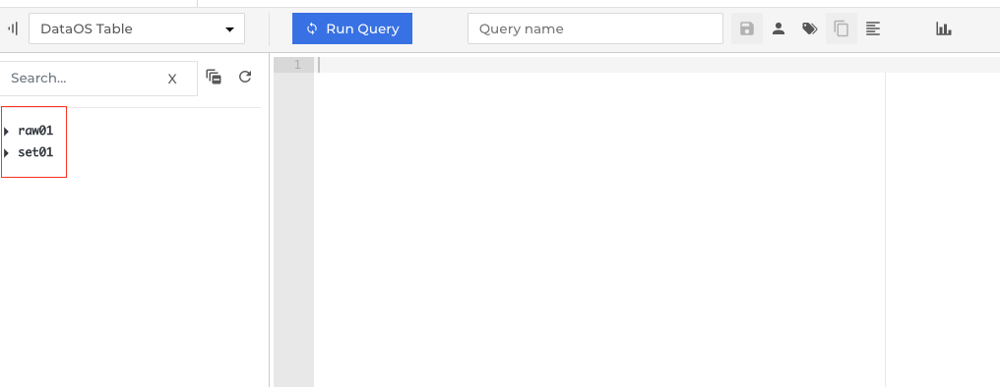


## Features
### Create a query
Once the connection and schema have been chosen (Refer ‘Choosing a connection’ from the table of contents), one can starting writing the query. 

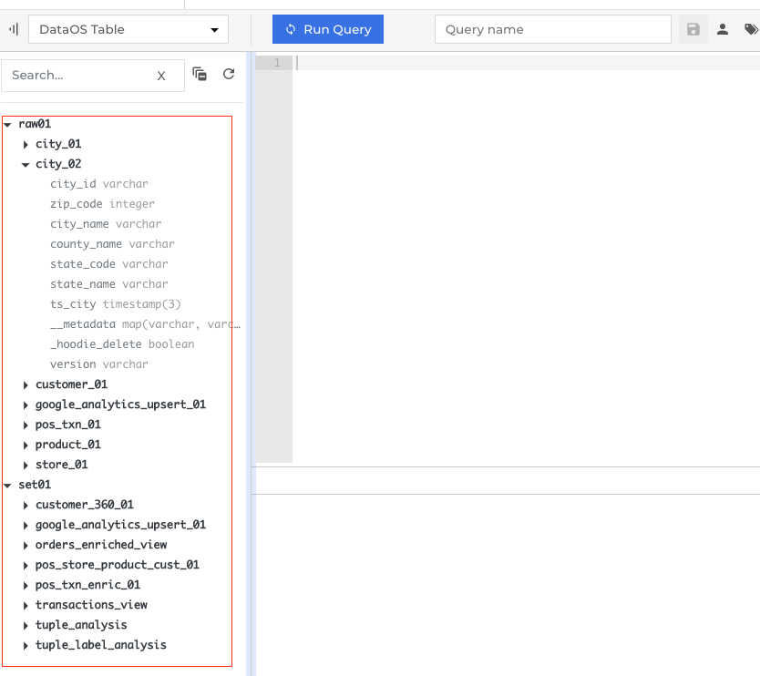

To begin with, a simple query can help you understand better:
`SELECT * FROM raw01.city_02 LIMIT 10`

Where raw01 and city_02 are the schema and table names respectively. 
While the query is being formulated, the auto-complete functionality suggests the probable options (raw01, city_02 etc) and their types (raw01 schema, city_02 table etc)

Refer the following screenshots for more clarity:

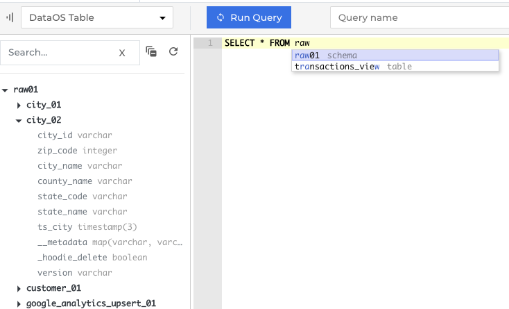

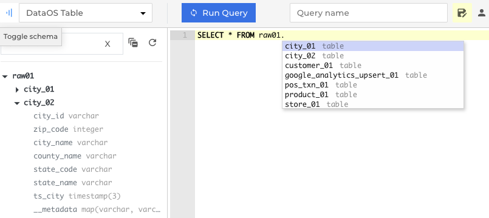

#### Formatting shortcut  
Quick format shortcut saves the effort needed to organize a long complicated query and makes it easier to troubleshoot through the logic.

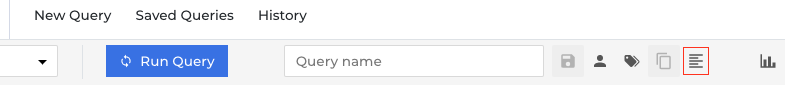

A query written in any form,

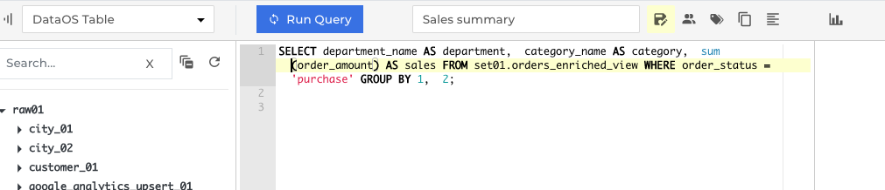

can be formatted to a more readable structure

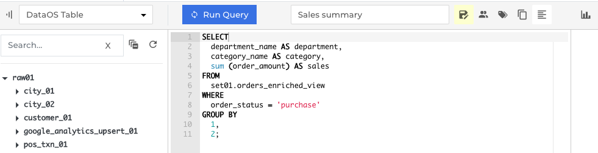

### Visualize results

User has the option to generate visualizations on the query results in a chart format. He can choose between line chart, bar chart, stacked bar or a scatter plot to better analyze the patterns.

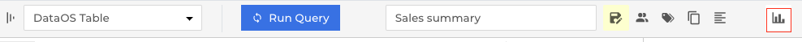

Following are the forms of chart formats supported as of now:

1. Line chart
2. Bar chart
     - Horizontal
     - Vertical
3. Scatterplot
4. Stacked bar chart
     - Horizontal
     - Vertical

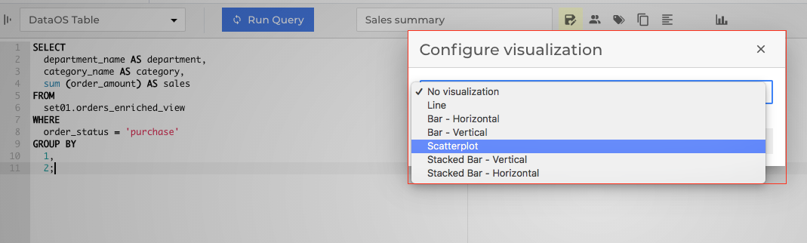

As an example, let us take the following query:

`SELECT department_name as department, category_name as category, sum (order_amount) as sales FROM set01.orders_enriched_view WHERE order_status = 'purchase' GROUP BY 1,2;`

This query, which fetches the department-wise retail sales data, can be better visualized using a scatterplot. Here, y-axis shows the sales revenue and x-axis shows the department types and category of each sale is represented by the colour of each circle e.g Red - Mens Shorts etc.

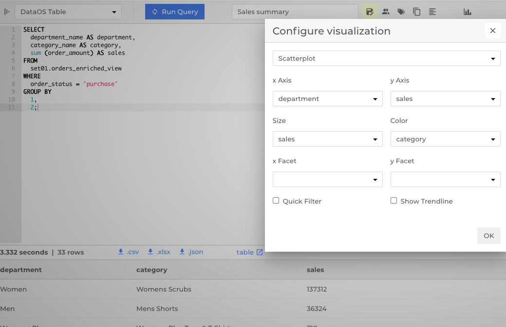


### Export Results

The results of a query can be exported into a .csv, .xlsx or a .json file. 

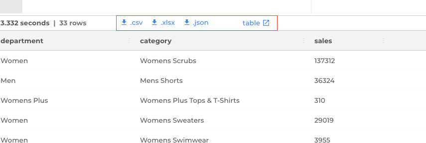

The results can also be viewed in a tabular format as depicted in the screenshot below. The link can copied and shared for reference. Download option still enables the user to download the file in the same formats. 
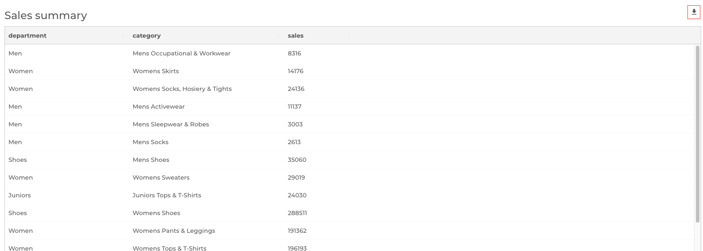

This also helps in keeping an audit trail of who (user who opened the link and then downloaded, has to be logged into DataOS® at the time) downloaded the file, which is not possible when the file is downloaded first and then shared with anyone.

Query results can also be exported to dashboard to plot a chart,

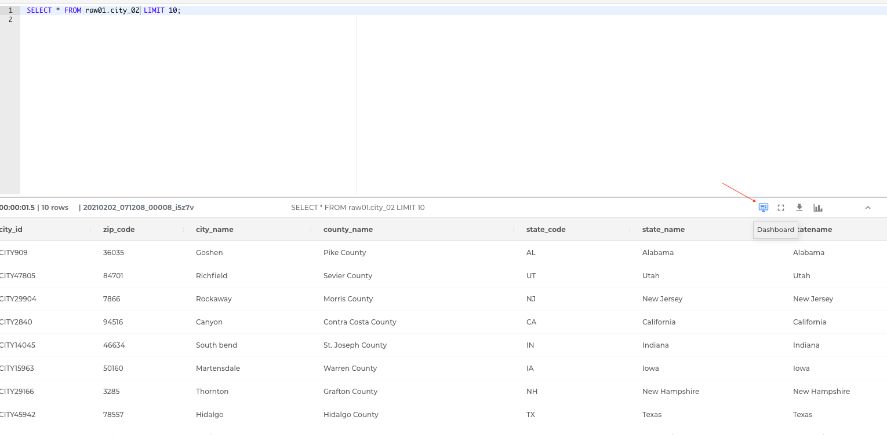

after providing the query name, description and tags.

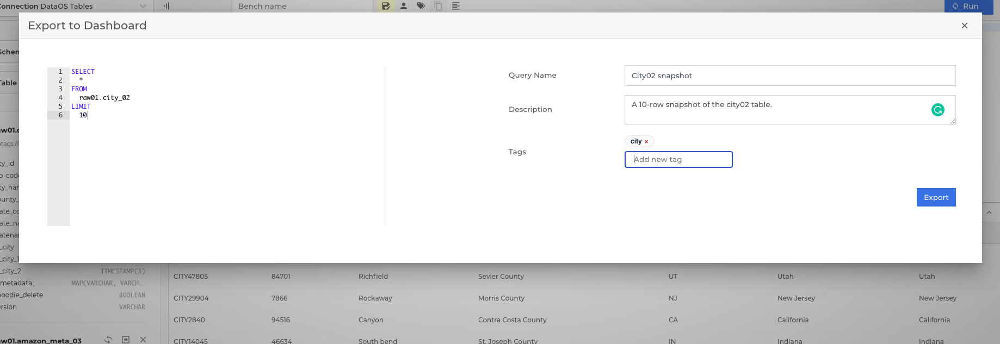

Once in the Dashboard app, relevant visualizations and edits can be made to achieve the desired cahrts.

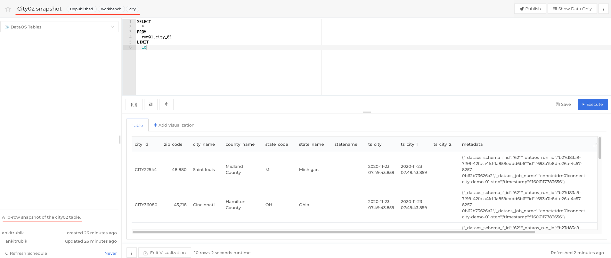

### Saved Benches

Queries can be saved after assigning a relevant name for future reference.

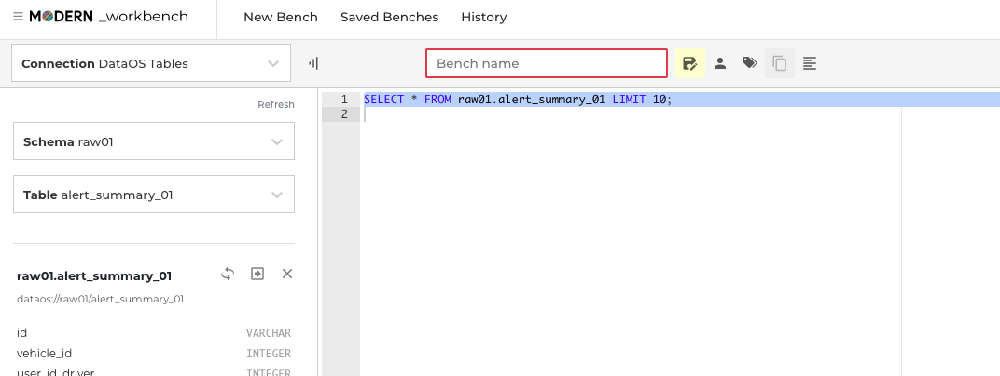

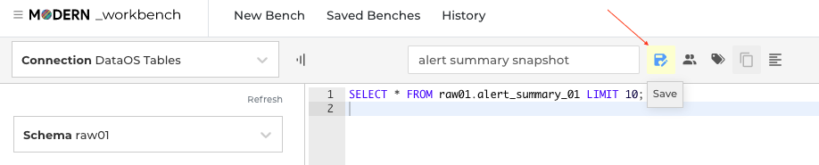

User can make the bench Public or Private as he deems fit. Private benches are not visible to any other user, Public benches are visible to and editable by anyone.

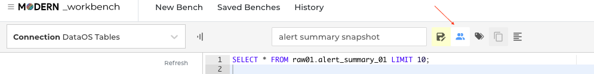

User has the option to add tags to each of the saved benches. And it is strongly encouraged, as it helps a lot, functionally, to understand the context of the queries and to optimize searching entities. Tags have been provisioned extensively across DataOS®. Tags will also help in audits to understand the purpose behind an activity.


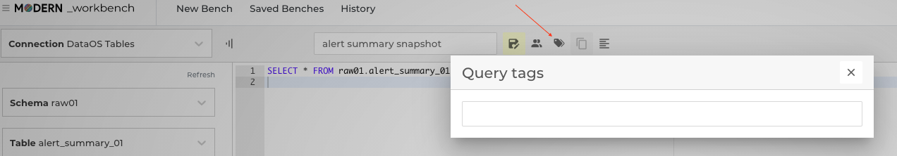

### History
User will be able to view queries run by other users and himself, using the history tab on top.


This feature helps in the following ways:

- Educating users: Users can refer to previously run queries to learn and reuse, part or whole query to achieve the desired results. This saves a lot of their time, otherwise spent in studying schema and tables and validating query logic and syntax.
- Review and validation: Users can go to history to validate queries run by others to further optimize and focus on a pertinent subset of data from the results.
- Re-Fetching old data: Users can go in and run their own queries to refetch previously saved data.

### Studio

This feature can be accessed via the toggle switch as shown below:

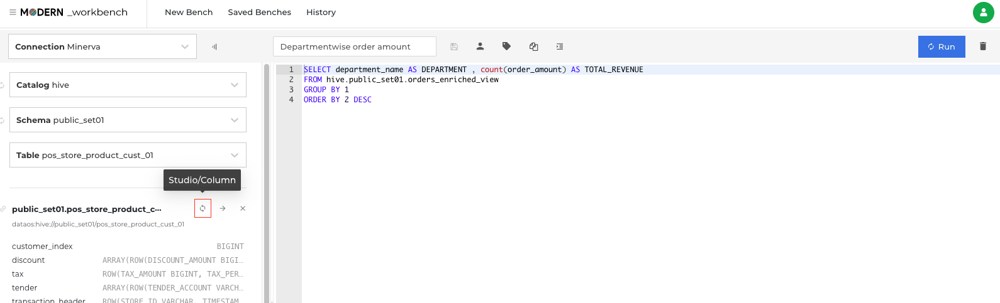

Studio offers two ways for the user to generate a query. 

- Aggregate
- Raw Records

Aggregate option serves the user with column based 'Measures', which are different statistical functions for each column. 

'Group By' allows the user to summarize the datasets  based on column(s) and perform aggregation on top of it.

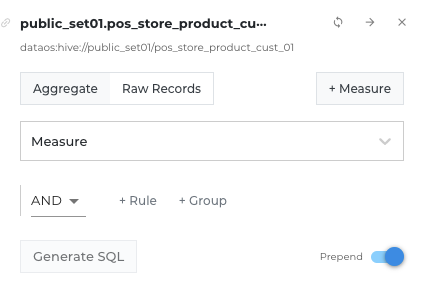

Time refers to the columns which timestamps, which can be used.
Date Range and Granularity are further filters for the timestamp.

'+Rule' offers use of relational operators based on column's datatype.

'+Group' adds a new group of rules

Finally, 'Generate SQL' converts the studio field values into an editable SQL query on the editor pane on the right side.

Raw Records option, offers a different approach to the user. Instead of measures, user can find a simple list of columns (with their datatypes) and create rules and groups as per need.

A 'Measure' can be added via the '+Measure' button, wherein user can insert his query to generate the custom measure he is looking for. 

Prepend toggle lets the user keep his latest generated query on top.


## Recipes/ Examples
### 1: Converting JSON array of object into rows using ‘UNNEST’

Problem statement: Convert a JSON array of objects to an explorable row format.

Key:
- ‘Events’ : Table
- ‘Properties’: Column holding the JSON string, one of the attributes of which is an array of objects.

```json
{
 "event": "click_event",
 "properties": {
   "section": "top_nav",
   "items": [{
     "item_id": 12345,
     "position": 1
   }, {
     "item_id": 67890,
     "position": 2
   }, {
     "item_id": 54321,
     "position": 3
   }]
 }
}
```

This data needs to be queried into the following resultant form:

event | section | item_id | position
---- | ---- | ---- | ----
click_event | top_nav | 12345 | 1
click_event | top_nav | 67890 | 2
click_event | top_nav | 54321 | 3

For this we will use  the UNNEST function, which is used to expand an ARRAY or MAP into a relation. 

**Step 1: Converting the array of objects to an array of map:**

```sql
SELECT
 json_extract_scalar(properties, '$.event') AS event,
 json_extract_scalar(properties, '$.section') AS section,
 CAST(json_extract(properties, '$.items') AS ARRAY<MAP<VARCHAR, VARCHAR>>) AS items
FROM
 events
```

Here: 

- `json_extract_scalar`: Parses the json string a returns a `varchar` value.
- `json_extract`: Parses the json string a returns a `json` value.

event | section | items
---- | ---- | ----
click_event | top_nav | [{item_id=12345, position=1}, {item_id= 567890, position=2}, {tem_id=54321, position=3}]

**Step 2: Breaking array into rows**

```sql
SELECT
 event,
 section,
 item
FROM
(
 SELECT
   json_extract_scalar(properties, '$.event') AS event,
   json_extract_scalar(properties, '$.section') AS section,
   CAST(json_extract(properties, '$.items') AS ARRAY<MAP<VARCHAR, VARCHAR>>) AS items
 FROM
   events
)
CROSS JOIN UNNEST(items) AS items(item)
```

The query above achieves breaking ‘Items’ array into separate ‘item’ rows. The result is as following: 

event | section | items
---- | ---- | ----
click_event | top_nav | {item_id=12345, position=1}
click_event | top_nav | {item_id= 567890, position=2}
click_event | top_nav | {tem_id=54321, position=3}

**Step 3: Break the values of map into separate columns**

```sql
SELECT
    event,
    section,
    item['item_id'] AS item_id,
    item['position'] AS position
FROM (
    SELECT
        json_extract_scalar (properties, '$.event') AS event,
        json_extract_scalar (properties, '$.section') AS section,
        CAST(json_extract (properties, '$.items') AS ARRAY < MAP < varchar, varchar >>) AS items
    FROM
        events)
    CROSS JOIN UNNEST(items) AS items (item)
```

event | section | item_id | position
---- | ---- | ---- | ----
click_event | top_nav | 12345 | 1
click_event | top_nav | 67890 | 2
click_event | top_nav | 54321 | 3

Source: https://medium.com/@hafizbadrie/prestodb-convert-json-array-of-objects-into-rows-d9c916724dfc

### 2: SQL queries for Funnel Analysis

Funnels, as the name suggests, represent the flow of users performing multiple succedent events. One such funnel could be calculating the conversion rate of users, by analyzing how many users start and progress to which step while using a product. This is how one can localise the user retention issues, and work on fixing the problem area.

Engagement Flow:

***User Sign up → Product integration → Schedule report (First use of the product)***

**Step 1: User sign up**

Table: Bots *(Users are termed bots here)*

To get the number of sign ups in the month of May:

```sql
SELECT count(*)
FROM bots
WHERE created_at BETWEEN ‘2017-05-01’ AND ‘2017-05-31’
```

`Count: 745`

**Step 2: Product Integration**

Table: Integrations *(Each activity around a product integration is recorded here)*

To get the number of integrations in the month of May:

```sql
SELECT count(*)
FROM bots
WHERE
 (SELECT count(*)
 FROM integrations
 WHERE integrations.bot_id = bots.id)>0
 AND created_at BETWEEN ‘2017-05-01’ AND ‘2017-05-31’
```

`Count: 104`

**Step 3: Report Scheduling (First Use)**

Table: scheduled_reports *(records all activity pertaining to report scheduling)*

To get the number of integrations in the month of May:

```sql
SELECT count(*)
FROM bots
WHERE
  (SELECT count(*)
  FROM integrations
  WHERE integrations.bot_id = bots.id)>0
AND
  (SELECT count(*)
  FROM scheduled_reports
  WHERE scheduled_reports.bot_id = bots.id)>0
AND created_at BETWEEN ‘2017-05-01’ AND ‘2017-05-31’
```

`Count:61`


