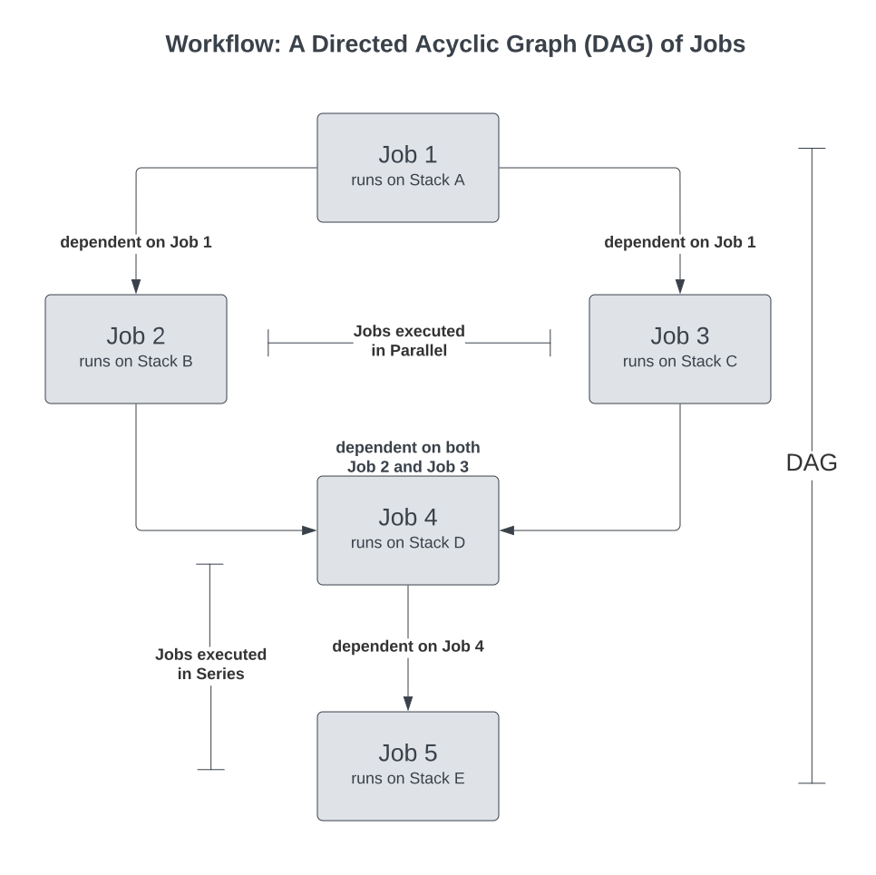

# Technical Documentation Style Guide

The primary objective of a style guide is to establish and maintain uniformity in terminology, phrasing, and formatting throughout the entirety of the technical documentation. The technical documentation specifically caters to Data Developers persona.

## 1. Writing Style

### 1.1 Language
Use plain, simple American English whenever possible.

### 1.2 Tone
The tone should be clear, professional, fact-based, and direct. Please refrain from using humor, buzzwords, or cultural references, as they have the potential to confuse or alienate the audience. Furthermore, abstain from the use of promotional language or marketing clichés - the goal here is to inform, not to sell.

### 1.3 Active vs. Passive Voice
Write in active voice whenever possible. This makes the documentation easier to understand and follow.

## 2. Document Formatting

### 2.1 Lists
Specify when and how to use bulleted and numbered lists.

When the list contains statements that have to be executed in a specific order

1. A
2. B
3. C

When the list contains statements that don't have any specific order of execution

1. random
2. rodent
3. ricardo

### 2.2 Colors
Define the color scheme, if any.

#### 2.2.1 Best Practices Block

<aside class="callout">
📖 Best Practice: It is part of the best practice to add relevant `description` and `tags` for your workflow. While `description` helps to determine what the workflow will help you accomplish, `tags` can help in faster searching in Metis and Operations.
</aside>

## 3. Code Formatting

Code samples, indentation rules, directory structure, and color schemes.
### 3.1 Code Samples

```yaml
name: ${this-is-a-sample} # Resource Name
version: ${v1} # Resource Manifest Version
type: workflow # Resource Type
workflow: # Workflow Section
    {workflow-specific-configuration}
```

### 3.2 Placeholders and Comments
```yaml
stack: ${flare:5.0} # Stack Name and Version
```
### 3.3 Directory Organization
To maintain consistency, each markdown page that contains nested pages should store its files using the parent page's name, written in Proper Case with hyphens.

*Example*

The structure would resemble the one given below
- workflow.md
- Workflow
    - workflow.svg
    - create-new-workflow-md
    - workflow-field-reference.md
    - Creating-New-Workflow
        - building-blocks.md
- cluster.md
- Cluster
    - cluster.jpeg
    - cluster-creation.md

### 3.4 Naming Conventions for Directories and Files
In order to maintain consistency and ensure compatibility with encoding standards, it is recommended to use hyphens ("-") instead of spaces when naming directories and files. Spaces in names are encoded as "%20" in URLs and can cause issues. 

**Example**

Acceptable directory names:
- Cluster
- Workflow-Creation

Unacceptable directory names:
- cluster
- workflow creation
- Workflow-creation

Acceptable file names:
- cluster.md
- new-workflow.jpg
- create-new-service.md

Unacceptable file names:
- cluster.md
- new-workflow.jpg
- create-new-service.md
### 3.5 Inline code
Colour - Default

Inline Code in Configuration Tables

Font Size - Regular Text

*Example*

`workflow`

`flare`

Inline Code in Configuration Reference Doc

Font Size - Heading3

*Example*

### `workflow`
### `flare`

## 4. Images and Graphics

### 4.1 Alignment
All images need to be center aligned.

### 4.2 Captioning



<center><i>Diagrammatic representation of a workflow</i></center>

### 4.3 File format
Acceptable formats for images - SVG, PNG, JPG, JPEG

## 5. Configuration
### 5.1 Configuration Table Format
The below is a sample table for configuration. Any kind of additional wildcards need to be specified in the section below.

| Field | Data Type | Default Value | Possible Value | Requirement |
| --- | --- | --- | --- | --- |
| `workflow` | object | None | None | Mandatory |
| `schedule` | object | None | None | Optional**  |
| `cron` | string | None | Any valid cron expression. | Optional**  |
| `concurrencyPolicy` | string | Allow | Allow/Forbid/Replace | Optional |
| `startOn` | string | None | Any time provided in ISO <br> 8601 format. | Optional |
| `name` | string | None | Any string confirming <br>the regex [a-z0-9]\([-a-z0-9]*<br>[a-z0-9]) and length less <br> than or equal to 48 | Mandatory |

<i>Optional**:</i> Fields optional for single-run workflows, but Mandatory for Scheduled workflows.

### 5.2 Configuration Reference
*Example 1*

### `cron`
<b>Description:</b> The cron field encompasses the cron expression, a string that comprises six or seven sub-expressions providing specific details of the schedule. <br>
<b>Data Type:</b> String <br>
<b>Requirement:</b> Optional (Mandatory for Scheduled Workflows) <br>
<b>Default Value:</b> None <br>
<b>Possible Value:</b> Any valid cron expression <br>
<b>Additional Details:</b> The cron expression consists of value separated by white spaces  <br>
<b>Example Usage:</b>
```yaml
cron: '*/10 * * * *' # Cron Expression
```
*Example 2*

### `concurrencyPolicy`
<b>Description:</b> The concurrencyPolicy field determines how concurrent executions of a workflow, created by a cron workflow, are handled<br>
<b>Data Type:</b> String <br>
<b>Requirement:</b> Optional <br>
<b>Default Value:</b> Allow <br>
<b>Possible Value:</b> Allow/Forbid/Replace <br>
<b>Additional Details:</b> <br>
- <i> concurrencyPolicy: Forbid -</i> When the concurrencyPolicy is set to "Forbid", the cron workflow strictly prohibits concurrent runs. In this scenario, if it is time for a new workflow run and the previous workflow run is still in progress, the cron workflow will skip the new workflow run altogether.  <br>
- <i> concurrencyPolicy: Allow -</i> On the other hand, setting the concurrencyPolicy to "Allow" enables the cron workflow to accommodate concurrent executions. If it is time for a new workflow run and the previous workflow run has not completed yet, the cron workflow will proceed with the new workflow run concurrently.  <br>
- <i> concurrencyPolicy: Replace -</i> When the concurrencyPolicy is set to "Replace", the cron workflow handles concurrent executions by replacing the currently running workflow run with a new workflow run if it is time for the next job workflow and the previous one is still in progress.  <br>

<b>Example Usage:</b>
```yaml
concurrencyPolicy: Replace # Concurrency Policy
```

## 6. Headings and Subheadings

### 6.1 Levels
Levels of headings and subheadings. Use Heading1 for Page Heading Only, not in rest of the text.

- # Heading 1
- ## Heading 2
- ### Heading 3
- #### Heading 4

### 6.2 Capitalization
Heading should be written in Proper Case 

*Example*
- CORRECT - 'Workflow Creation Guide for Developers'
- INCORRECT - 'workflow creation guide for developers'
- INCORRECT - 'Workflow Creation GUIDE For Developers'

## 7. Hyperlinks

### 7.1 Internal
Rules for linking to other parts of the same document.

<u>[Sample Link](./readme.md)</u>

### 7.2 External
Rules for linking to other documents or external resources.

<u>[Sample Link](https://www.google.com)</u>


## 8. Local Development Procedures

- Ensure that you have access to the repository `https://github.com/moderndatacompany/dataos.info`
- Ensure that you are operating with the most recent versions of Python and MkDocs.
- To create a local build, execute the following command:
```shell
mkdocs build
```
- For a local server, the command is as follows:
```shell
mkdocs serve
```
- Your documentation will be accessible on port 8000. To view it, simply copy the following URL into your browser:
```http
http://127.0.0.1:8000/
```

## 9. Update and Review Procedure

For modifications, all updates should be submitted to the `dev` branch, accompanied by an appropriate commit message. The repository manager is responsible for reviewing these updates, after which they would merge them into the `master` branch. Upon these changes being committed, they will automatically be reflected at the following web address: 

```http
https://moderndatacompany.github.io/dataos.info/
```


<!-- Below stuff has been added by Manish -->
<br>
    <div style="border: 2px dotted #e0e0e0; padding: 15px; border-radius:7px">
     This is a text box with a border.
     You can add any content here, such as text, images, or other Markdown elements.
    </div>
<br>
    <div style="border: 2px solid #e0e0e0;
     padding: 10px; border-radius:7px;
     outline: #e0e0e0 solid 5px;
     outline-offset: 5px">
     blah! blah! text with double border - outer one is called 'border' and the inner one is called 'outline'
     </div>
<br>


<details>     
<summary>This is how you create a toggle</summary>
- Stuff inside the toggle is written here. <br>
- Toggle can contain code blocks or quotes or callouts <br>
- Why this Kolaveri di
</details>  
  
  ```bash
  code block! finally!
  ```
  
  
  <!-- colour options -->

# Callouts

1.

<div style="padding:15px; border-radius:5px;">

📖 <i>Best Practice:</i> It is part of the best practice to add relevant `description` and `tags` for your workflow. While `description` helps to determine what the workflow will help you accomplish, `tags` can help in faster searching in Metis and Operations.
</div>

<br>

2.

<div style="background-color:#2B323C; padding:15px; border-radius:5px;">

📖 <i>Best Practice:</i> It is part of the best practice to add relevant `description` and `tags` for your workflow. While `description` helps to determine what the workflow will help you accomplish, `tags` can help in faster searching in Metis and Operations.
</div>

<br>

3.
<div style="background-color:#808389; padding:15px; border-radius:5px;">

📖 <i>Best Practice:</i> It is part of the best practice to add relevant `description` and `tags` for your workflow. While `description` helps to determine what the workflow will help you accomplish, `tags` can help in faster searching in Metis and Operations.
</div>
<br>

4.

<div style="background-color:#D4D5D7; padding:15px; border-radius:5px;">

📖 <i>Best Practice:</i> It is part of the best practice to add relevant `description` and `tags` for your workflow. While `description` helps to determine what the workflow will help you accomplish, `tags` can help in faster searching in Metis and Operations.
</div>
<br>

5.
<div style="background-color:# EBEEF2; padding:15px; border-radius:5px;">

📖 <i>Best Practice:</i> It is part of the best practice to add relevant `description` and `tags` for your workflow. While `description` helps to determine what the workflow will help you accomplish, `tags` can help in faster searching in Metis and Operations.
</div>
<br>

6.

<div style="background-color:#FFFFFF
; padding:15px; border-radius:5px;">

📖 <i>Best Practice:</i> It is part of the best practice to add relevant `description` and `tags` for your workflow. While `description` helps to determine what the workflow will help you accomplish, `tags` can help in faster searching in Metis and Operations.
</div>

<br>

7.

<div style="background-color:#CF433E; padding:15px; border-radius:5px;">

📖 <i>Best Practice:</i> It is part of the best practice to add relevant `description` and `tags` for your workflow. While `description` helps to determine what the workflow will help you accomplish, `tags` can help in faster searching in Metis and Operations.
</div>

<br>

8.
<div style="background-color:#F04F23; padding:15px; border-radius:5px;">

📖 <i>Best Practice:</i> It is part of the best practice to add relevant `description` and `tags` for your workflow. While `description` helps to determine what the workflow will help you accomplish, `tags` can help in faster searching in Metis and Operations.
</div>

<br>

9.
<div style="background-color:#FF9628; padding:15px; border-radius:5px;">

📖 <i>Best Practice:</i> It is part of the best practice to add relevant `description` and `tags` for your workflow. While `description` helps to determine what the workflow will help you accomplish, `tags` can help in faster searching in Metis and Operations.
</div>

<br>

10.
<div style="background-color:#FFC819; padding:15px; border-radius:5px;">

📖 <i>Best Practice:</i> It is part of the best practice to add relevant `description` and `tags` for your workflow. While `description` helps to determine what the workflow will help you accomplish, `tags` can help in faster searching in Metis and Operations.
</div>

<br>

11.
<div style="background-color:#EBE72E; padding:15px; border-radius:5px;">

📖 <i>Best Practice:</i> It is part of the best practice to add relevant `description` and `tags` for your workflow. While `description` helps to determine what the workflow will help you accomplish, `tags` can help in faster searching in Metis and Operations.
</div>

<br>

12.
<div style="background-color:#69B345; padding:15px; border-radius:5px;">

📖 <i>Best Practice:</i> It is part of the best practice to add relevant `description` and `tags` for your workflow. While `description` helps to determine what the workflow will help you accomplish, `tags` can help in faster searching in Metis and Operations.
</div>

<br>

13.
<div style="background-color:#0F6666; padding:15px; border-radius:5px;">

📖 <i>Best Practice:</i> It is part of the best practice to add relevant `description` and `tags` for your workflow. While `description` helps to determine what the workflow will help you accomplish, `tags` can help in faster searching in Metis and Operations.
</div>

<br>

14.
<div style="background-color:#83CFCA; padding:15px; border-radius:5px;">

📖 <i>Best Practice:</i> It is part of the best practice to add relevant `description` and `tags` for your workflow. While `description` helps to determine what the workflow will help you accomplish, `tags` can help in faster searching in Metis and Operations.
</div>

<br>

15.
<div style="background-color:#5D87A1; padding:15px; border-radius:5px;">

📖 <i>Best Practice:</i> It is part of the best practice to add relevant `description` and `tags` for your workflow. While `description` helps to determine what the workflow will help you accomplish, `tags` can help in faster searching in Metis and Operations.
</div>

<br>

16.
<div style="background-color:#3CBCF0; padding:15px; border-radius:5px;">

📖 <i>Best Practice:</i> It is part of the best practice to add relevant `description` and `tags` for your workflow. While `description` helps to determine what the workflow will help you accomplish, `tags` can help in faster searching in Metis and Operations.
</div>

<br>

17.
<div style="background-color:#0192CD; padding:15px; border-radius:5px;">

📖 <i>Best Practice:</i> It is part of the best practice to add relevant `description` and `tags` for your workflow. While `description` helps to determine what the workflow will help you accomplish, `tags` can help in faster searching in Metis and Operations.
</div>

<br>

18.
<div style="background-color:#27559C; padding:15px; border-radius:5px;">

📖 <i>Best Practice:</i> It is part of the best practice to add relevant `description` and `tags` for your workflow. While `description` helps to determine what the workflow will help you accomplish, `tags` can help in faster searching in Metis and Operations.
</div>

<br>

19.
<div style="background-color:#6961B4; padding:15px; border-radius:5px;">

📖 <i>Best Practice:</i> It is part of the best practice to add relevant `description` and `tags` for your workflow. While `description` helps to determine what the workflow will help you accomplish, `tags` can help in faster searching in Metis and Operations.
</div>

<br>

20.
<div style="background-color:#F2A9C8;font-color:#FFFFFF; padding:15px; border-radius:5px;">

📖 <i>Best Practice:</i> It is part of the best practice to add relevant `description` and `tags` for your workflow. While `description` helps to determine what the workflow will help you accomplish, `tags` can help in faster searching in Metis and Operations.
</div>

<br>

21.
<div style="background-color:#FF9628; padding:15px; border-radius:5px;">

📖 <i>Best Practice:</i> It is part of the best practice to add relevant `description` and `tags` for your workflow. While `description` helps to determine what the workflow will help you accomplish, `tags` can help in faster searching in Metis and Operations.
</div>

<br>

22.
<div style="background-color:#EF4059; padding:15px; border-radius:5px;">

📖 <i>Best Practice:</i> It is part of the best practice to add relevant `description` and `tags` for your workflow. While `description` helps to determine what the workflow will help you accomplish, `tags` can help in faster searching in Metis and Operations.
</div>

<br>

23.
<div style="background-color:#FFFFFF; padding:15px; border-radius:5px;">

📖 <i>Best Practice:</i> It is part of the best practice to add relevant `description` and `tags` for your workflow. While `description` helps to determine what the workflow will help you accomplish, `tags` can help in faster searching in Metis and Operations.
</div>

<br>

24.
<div style="background-color:#EBECED; padding:15px; border-radius:5px;">

📖 <i>Best Practice:</i> It is part of the best practice to add relevant `description` and `tags` for your workflow. While `description` helps to determine what the workflow will help you accomplish, `tags` can help in faster searching in Metis and Operations.
</div>

<br>

25.
<div style="background-color:#E9E5E3; padding:15px; border-radius:5px;">

📖 <i>Best Practice:</i> It is part of the best practice to add relevant `description` and `tags` for your workflow. While `description` helps to determine what the workflow will help you accomplish, `tags` can help in faster searching in Metis and Operations.
</div>

<br>

26.
<div style="background-color:#FAEBDD; padding:15px; border-radius:5px;">

📖 <i>Best Practice:</i> It is part of the best practice to add relevant `description` and `tags` for your workflow. While `description` helps to determine what the workflow will help you accomplish, `tags` can help in faster searching in Metis and Operations.
</div>

<br>

27.
<div style="background-color:#FBF3DB; padding:15px; border-radius:5px;">

📖 <i>Best Practice:</i> It is part of the best practice to add relevant `description` and `tags` for your workflow. While `description` helps to determine what the workflow will help you accomplish, `tags` can help in faster searching in Metis and Operations.
</div>

<br>

28.
<div style="background-color:#DDEDEA; padding:15px; border-radius:5px;">

📖 <i>Best Practice:</i> It is part of the best practice to add relevant `description` and `tags` for your workflow. While `description` helps to determine what the workflow will help you accomplish, `tags` can help in faster searching in Metis and Operations.
</div>

<br>

29.
<div style="background-color:#DDEBF1; padding:15px; border-radius:5px;">

📖 <i>Best Practice:</i> It is part of the best practice to add relevant `description` and `tags` for your workflow. While `description` helps to determine what the workflow will help you accomplish, `tags` can help in faster searching in Metis and Operations.
</div>

<br>

30.
<div style="background-color:#EAE4F2; padding:15px; border-radius:5px;">

📖 <i>Best Practice:</i> It is part of the best practice to add relevant `description` and `tags` for your workflow. While `description` helps to determine what the workflow will help you accomplish, `tags` can help in faster searching in Metis and Operations.
</div>

<br>

31.
<div style="background-color:#F4DFEB; padding:15px; border-radius:5px;">

📖 <i>Best Practice:</i> It is part of the best practice to add relevant `description` and `tags` for your workflow. While `description` helps to determine what the workflow will help you accomplish, `tags` can help in faster searching in Metis and Operations.
</div>

<br>

32.
<div style="background-color:#FBE4E4; padding:15px; border-radius:5px;">

📖 <i>Best Practice:</i> It is part of the best practice to add relevant `description` and `tags` for your workflow. While `description` helps to determine what the workflow will help you accomplish, `tags` can help in faster searching in Metis and Operations.
</div>

<br>

33.
<div style="background-color:#2F3437; padding:15px; border-radius:5px;">

📖 <i>Best Practice:</i> It is part of the best practice to add relevant `description` and `tags` for your workflow. While `description` helps to determine what the workflow will help you accomplish, `tags` can help in faster searching in Metis and Operations.
</div>

<br>

34.
<div style="background-color:#454B4E; padding:15px; border-radius:5px;">

📖 <i>Best Practice:</i> It is part of the best practice to add relevant `description` and `tags` for your workflow. While `description` helps to determine what the workflow will help you accomplish, `tags` can help in faster searching in Metis and Operations.
</div>

<br>

35.
<div style="background-color:#434040; padding:15px; border-radius:5px;">

📖 <i>Best Practice:</i> It is part of the best practice to add relevant `description` and `tags` for your workflow. While `description` helps to determine what the workflow will help you accomplish, `tags` can help in faster searching in Metis and Operations.
</div>

<br>

36.
<div style="background-color:#594A3A; padding:15px; border-radius:5px;">

📖 <i>Best Practice:</i> It is part of the best practice to add relevant `description` and `tags` for your workflow. While `description` helps to determine what the workflow will help you accomplish, `tags` can help in faster searching in Metis and Operations.
</div>

<br>

37.
<div style="background-color:#59563B; padding:15px; border-radius:5px;">

📖 <i>Best Practice:</i> It is part of the best practice to add relevant `description` and `tags` for your workflow. While `description` helps to determine what the workflow will help you accomplish, `tags` can help in faster searching in Metis and Operations.
</div>

<br>

38.
<div style="background-color:#354C4B; padding:15px; border-radius:5px;">

📖 <i>Best Practice:</i> It is part of the best practice to add relevant `description` and `tags` for your workflow. While `description` helps to determine what the workflow will help you accomplish, `tags` can help in faster searching in Metis and Operations.
</div>

<br>

39.
<div style="background-color:#364954; padding:15px; border-radius:5px;">

📖 <i>Best Practice:</i> It is part of the best practice to add relevant `description` and `tags` for your workflow. While `description` helps to determine what the workflow will help you accomplish, `tags` can help in faster searching in Metis and Operations.
</div>

<br>

40.
<div style="background-color:#443F57; padding:15px; border-radius:5px;">

📖 <i>Best Practice:</i> It is part of the best practice to add relevant `description` and `tags` for your workflow. While `description` helps to determine what the workflow will help you accomplish, `tags` can help in faster searching in Metis and Operations.
</div>

<br>

41.
<div style="background-color:#533B4C; padding:15px; border-radius:5px;">

📖 <i>Best Practice:</i> It is part of the best practice to add relevant `description` and `tags` for your workflow. While `description` helps to determine what the workflow will help you accomplish, `tags` can help in faster searching in Metis and Operations.
</div>

<br>

42.
<div style="background-color:#594141; padding:15px; border-radius:5px;">

📖 <i>Best Practice:</i> It is part of the best practice to add relevant `description` and `tags` for your workflow. While `description` helps to determine what the workflow will help you accomplish, `tags` can help in faster searching in Metis and Operations.
</div>

<!-- colour options end here -->
     

## Design element

Add multiple images in a single slide! Just copy and edit the below code to add the images.

<!DOCTYPE html>
<html>
<head>
    <style>
        .carousel {
            position: relative;
            max-width: 100%;
            margin: auto;
            overflow: hidden;
        }
        .carousel img {
            width: 100%;
            height: auto;
            display: block;
        }
        .carousel-dots {
            text-align: center;
            position: absolute;
            bottom: 10px;
            width: 100%;
        }
        .carousel-dot {
            display: inline-block;
            height: 12px;
            width: 12px;
            margin: 0 4px;
            background-color: #bbb;
            border-radius: 50%;
            cursor: pointer;
        }
        .active {
            background-color: #717171;
        }
    </style>
</head>
<body>

<div class="carousel">
    
    
    
    <div class="carousel-dots">
        <span class="carousel-dot active" onclick="currentSlide(1)"></span>
        <span class="carousel-dot" onclick="currentSlide(2)"></span>
        <span class="carousel-dot" onclick="currentSlide(3)"></span>
    </div>
</div>

<script>
    var slideIndex = 1;
    showSlides(slideIndex);

    function currentSlide(n) {
        showSlides(slideIndex = n);
    }

    function showSlides(n) {
        var i;
        var slides = document.querySelectorAll(".carousel img");
        var dots = document.querySelectorAll(".carousel-dot");
        if (n > slides.length) {slideIndex = 1}
        if (n < 1) {slideIndex = slides.length}
        for (i = 0; i < slides.length; i++) {
            slides[i].style.display = "none";
        }
        for (i = 0; i < dots.length; i++) {
            dots[i].className = dots[i].className.replace(" active", "");
        }
        slides[slideIndex-1].style.display = "block";
        dots[slideIndex-1].className += " active";
    }
</script>

</body>
</html>


